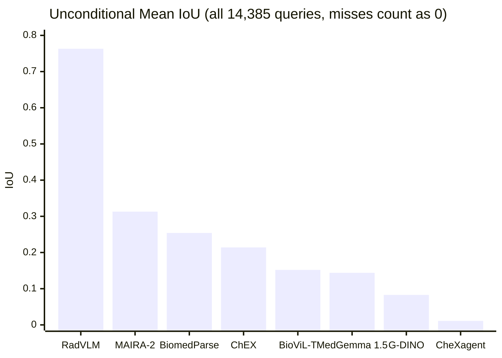
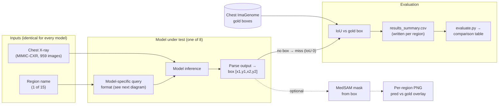
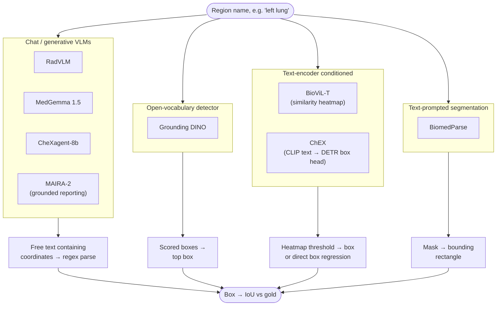
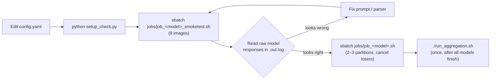

# CXR Grounding Benchmark

Benchmarking visual grounding models for localizing **15 anatomical regions** in
chest X-rays against radiologist-validated gold-standard boxes from
[Chest ImaGenome](https://physionet.org/content/chest-imagenome/1.0.0/).

**Eight models** are evaluated under one standardized protocol: the same 959
images, the same 15 region definitions, the same IoU metric, **14,385
region-queries per model**. Every model grounds from the **image plus a text
query alone** — no radiology report is ever given as input.

Images and model weights are not included — access requires a PhysioNet
credentialed account (see [Data Access](#data-access)).

**Contents:** [Results](#results) · [How the benchmark works](#how-the-benchmark-works) ·
[Prompts per model](#what-prompt-was-used-for-each-model) ·
[Known issues](#known-issues-and-findings-read-before-citing-per-model-numbers) ·
[Repo layout](#repository-layout) · [Running on HPC](#running-on-sharanga-hpc) ·
[Models & setup](#models) · [Data access](#data-access)

---

## Results

| Rank | Model | Unconditional Mean IoU | Conditional Mean IoU | Detection Rate |
|---:|---|---:|---:|---:|
| 1 | **RadVLM** | **0.763** | 0.764 | 99.9% |
| 2 | MAIRA-2 ⚠️ | 0.313 | 0.433 | 72.1% |
| 3 | BiomedParse | 0.254 | 0.268 | 94.7% |
| 4 | ChEX ⚠️ | 0.214 | 0.220 | 97.4% |
| 5 | BioViL-T | 0.152 | 0.152 | 100.0% |
| 6 | MedGemma 1.5 (4B) | 0.144 | 0.144 | 100.0% |
| 7 | Grounding DINO | 0.083 | 0.083 | 100.0% |
| 8 | CheXagent-8b ⚠️ | 0.011 | 0.095 | 11.3% |

<sub>Ranked by unconditional IoU. ⚠️ = see [Known Issues](#known-issues-and-findings-read-before-citing-per-model-numbers)
before citing — CheXagent's and MAIRA-2's scores are provisional. All models ran on all 959 images.</sub>



**Two IoU numbers, on purpose.** They disagree sharply for models that often
decline to answer:

- **Unconditional Mean IoU** — averaged over *all* 14,385 queries, a missed
  region counts as IoU 0. *"How much correct, localized area does the model
  deliver overall?"* **Use this one to rank models.**
- **Conditional Mean IoU** — averaged only over queries where the model returned
  a usable box. *"How accurate is it when it answers?"* On its own this rewards
  abstention (compare CheXagent's 0.095 vs 0.011).

RadVLM's training data explicitly includes Chest ImaGenome box-grounding
supervision in this exact coordinate convention — it is the only model here
trained end-to-end on the task being measured, which is the main reason for the
gap. One image is missing its gold box for "right lower lung zone" and is handled
identically for every model (see Known Issues).

---

## How the benchmark works



The only thing that varies between models is the *query format* and the
*output parser*, because the eight systems accept fundamentally different
inputs:



---

## What prompt was used for each model

**The prompt text is NOT identical across models** — there is no single prompt
string all eight architectures accept. What **is** held constant: the same 15
region names, the same task (produce a box for this named region), and
**image-only input — no pre-existing radiology report is given to any model.**

| Model | Input mechanism | Exact prompt / query |
|---|---|---|
| Grounding DINO | Native phrase-grounding detector call | Region name passed directly as the detection query (no full-sentence prompt) |
| BioViL-T | Native phrase-grounding / similarity-heatmap API | Region name as the text phrase; box derived by thresholding the similarity heatmap |
| CheXagent-8b | Chat prompt (`USER: ... ASSISTANT:`) | `Perform phrase grounding for "{phrase}" in this chest X-ray. Provide the bounding box as [x1, y1, x2, y2] in pixel coordinates.` |
| MedGemma 1.5 | Chat prompt | `Locate the {region} in this chest X-ray. Provide the bounding box as [x1, y1, x2, y2] with coordinates normalized between 0 and 1.` |
| RadVLM | LLaVA-OneVision chat template | `Locate the {region} in this chest X-ray. Provide the bounding box as [x1, y1, x2, y2] with coordinates normalized between 0 and 1.` |
| MAIRA-2 | MAIRA-2's own grounded-reporting generation call | Region name passed as the grounding target; MAIRA-2 generates its own report-style text and links a box to it when the phrasing reads as a "finding" (see Known Issues) |
| BiomedParse | Text-prompted segmentation API | Region name as the segmentation prompt; box = bounding rectangle of the predicted mask |
| ChEX | CLIP-style text encoder, not a generative prompt | Title-case anatomy name from ChEX's own training vocabulary (`conf/dataset/anatomy_names/cig_default.yaml`), e.g. `"Right lung."` — all 15 regions encoded once per image in a single batched call |

---

## Known issues and findings (read before citing per-model numbers)

Found via a systematic audit (per-region left/right cross-checks, raw-response
inspection, and source-level verification for ChEX) after the full runs. They
are documented rather than silently fixed so anyone using this benchmark can see
exactly what was checked.

| Model | Issue | Status | Effect on numbers |
|---|---|---|---|
| ChEX | Left/right anatomical confusion | ✅ Verified genuine (source-traced) | Real model property — numbers stand |
| CheXagent | Prompt-format mismatch (echoes placeholder) | ⚠️ Unresolved | 0.095 / 0.011 likely **understate** it |
| MAIRA-2 | Task-framing mismatch on whole-organ regions | ⚠️ Unresolved | 0.433 / 0.313 likely **understate** it |
| MedGemma 1.5 | Mild left/right confusion on 3 regions | Likely genuine, unconfirmed | Numbers stand |
| All | 1 missing gold annotation | Handled identically | No ranking change |
| All | Costophrenic-angle IoU is misleading | Context needed | Check recall@0.1 |

### ChEX: genuine left/right confusion (verified against source, not a harness bug)
ChEX's predictions for left-labeled regions systematically land near the
correct *right*-side structure instead of the correct left-side one (e.g.
"left lung" prediction matches "right lung" gold at IoU 0.41 vs only 0.16
against its own "left lung" gold). This was traced through ChEX's actual
`encode_prompts()`/`detect_prompts()` source
(`chex/src/model/chex.py:448-515`): prompt order is correctly preserved
end-to-end, box regression is conditioned purely on each prompt's own text
embedding, and there is no fixed-vocabulary index lookup that could explain a
harness-side swap. "Right lung" and "left lung" produce genuinely different
(not duplicated) box coordinates on the same image, ruling out a simple
aliasing bug. The most likely explanation is that ChEX's text encoder does not
sufficiently separate "left" from "right" anatomical prompts to drive its box
head to the correct hemisphere — a real property of the trained model, not
something fixable in this evaluation harness. Reported as a finding, not
patched.

### CheXagent: likely prompt-format mismatch (not fully resolved — do not treat 0.095/0.011 as final)
Inspecting raw model responses shows CheXagent frequently returns the literal
placeholder text `"[x1, y1, x2, y2]"` from our prompt instruction instead of
generating real coordinates. Critically, on the queries where it *does*
ground successfully, it spontaneously uses its own native output format
(`<ref>ClassName</ref><box>(x1,y1),(x2,y2)</box>`) rather than the
`[x1,y1,x2,y2]` format our prompt asks for. This strongly suggests our current
prompt does not match how CheXagent was trained to respond, and that its
11.3% detection rate understates its real capability. **A corrected prompt
that elicits CheXagent's native `<ref><box>` format should be tested before
these numbers are used in any final comparison or publication.**

### MAIRA-2: task-framing mismatch on whole-organ queries (not fully resolved)
MAIRA-2's detection rate varies enormously by region — 7.3% for "right lung"
vs 94.1% for "left mid lung zone" — and the pattern maps precisely onto
whether the region name reads like a radiology-report *finding*. For "right
lung"/"left lung" MAIRA-2 returns generic negative-findings report boilerplate
("No confluent pulmonary infiltrates are seen...") with no box, since MAIRA-2
is a *grounded reporting* model trained to link report findings to boxes, and
a whole organ is rarely phrased as a finding in real reports. For
"mediastinum," "trachea," and the lung zones, which do read like plausible
report-sentence subjects, it correctly returns `<obj>findings in the
X.<box>...</box></obj>`. **Reframing whole-organ queries to read like a
report finding should be tested before treating 0.433/0.313 as final.**

### MedGemma 1.5: mild, likely genuine left/right confusion
A milder version of ChEX's pattern shows up on 3 of 15 regions (right upper
lung zone, right lower lung zone, right hilar region). Since MedGemma's
prompt is a plain-English sentence with no coordinate-mapping code involved
(`f"Locate the {region}..."`), this is most likely a genuine zero-shot
vision-language model limitation rather than a code bug, but it has not been
independently confirmed the way ChEX's issue was.

### One missing gold annotation
Image `acb299f2-449ffbaf-848f8dc9-07d91ecc-73d7bc8d` has no gold box for
"right lower lung zone." All 8 models still produced a prediction for it; the
instance is excluded from Conditional Mean IoU and counted as 0 in
Unconditional Mean IoU for every model equally, so it does not change any
model's ranking relative to the others.

### Costophrenic angles are not uniformly "hard" — check recall@0.1, not just IoU
Raw IoU on the costophrenic angles is low for most models, but RadVLM's
recall@0.1 (fraction of predictions with IoU ≥ 0.1) is 95% and its
gold-center-inside-predicted-box rate is ~90% for both angles — meaning it
does find the correct location almost every time; the low raw IoU reflects
that a small anatomical target is punished disproportionately by IoU geometry
for any small offset, not a real localization failure. Grounding DINO shows
the opposite pattern (93-95% center-in-box despite 0% recall@0.1), which
indicates a degenerate near-whole-image predicted box, not real localization.
**Don't cite "costophrenic angle is inherently hard for every model" without
this context** — it's true for most models but specifically false for RadVLM.

---

## Repository layout

```
cxr-grounding-benchmark/
├── cxr_common.py            # shared loaders, IoU, plotting, config resolution
├── config.yaml              # all paths for full runs (no hardcoded paths in scripts)
├── config_smoketest.yaml    # 8-image config → outputs_smoketest/
├── evaluate.py              # aggregates every model's results_summary.csv
├── compare_results.py
├── setup_check.py           # pre-flight environment check (exit 1 on failure)
├── run_aggregation.sh       # run once, after all model jobs finish
├── requirements_*.txt       # one per conda env
├── models/                  # one inference script per model (8)
├── jobs/                    # Slurm job scripts (full runs, smoke tests, per-partition variants)
├── debug/                   # one-off investigation scripts + their jobs
├── figures/                 # figure / slide / comparison-grid generators
└── *_report/                # per-model HTML report builders
```

`cxr_common.py` and the configs deliberately stay at the repo root. Model
scripts do a plain `from cxr_common import ...`, so every job script exports
`PYTHONPATH=<repo root>` before running `python models/<script>.py`. ChEX and
BiomedParse are the exception: their job scripts copy the model script (plus
`cxr_common.py`) into the externally cloned ChEX / BiomedParse repo and run it
from there, because those codebases only import correctly from their own
directories.

---

## Running on Sharanga HPC



All paths live in **`config.yaml`** at the repo root. Edit it once (GOLD_CSV,
IMAGE_DIR, RADVLM_PATH, OUTPUT_DIR, MAX_IMAGES, HF_HOME, BIOMEDPARSE_REPO), then
submit from the repo root:

```bash
python setup_check.py          # verify the environment first

sbatch jobs/job_gdino.sh
sbatch jobs/job_biovilt.sh
sbatch jobs/job_chexagent.sh
sbatch jobs/job_maira2.sh
sbatch jobs/job_medgemma15.sh
sbatch jobs/job_chex.sh
sbatch jobs/job_biomedparse.sh
sbatch jobs/job_radvlm.sh

./run_aggregation.sh           # once, after every model has finished
```

Gated models (MAIRA-2, MedGemma) need `HF_TOKEN` set in your shell or a prior
`huggingface-cli login` — **never hardcode a token in a job script.**

Each job writes its `results_summary.csv` **incrementally** (one row per region)
to `OUTPUT_DIR/<model>/`, so partial results survive a wall-time kill.

**Always run the `*_smoketest` variant first** and read the raw model responses in
the Slurm `.out` log by hand — every real bug found in this project
(MedGemma's y-before-x coordinate order, CheXagent's placeholder echo, ChEX's
laterality issue) was caught this way, never by trusting a plausible-looking
IoU number.

### HPC queue time and script efficiency
Queue wait times are heavily contended and unpredictable (minutes to 47+ hours
for the same tiny job).
- Submit the same job to 2–3 partitions at once (e.g. `gpu_v100_2`,
  `gpu_a100_8`, `gpu_h100_4`) and cancel the losers once one starts.
- Encode the image once per image, not once per region — RadVLM's first version
  re-ran the vision encoder for each of the 15 prompts.
- Bump wall-time past what the smoke test's per-image rate implies —
  MedGemma's first full run hit the 23h cap at 954/959 images.

---

## Target regions (15)

| Whole structures | Lung zones | Hila & angles |
|---|---|---|
| Right Lung, Left Lung | Right/Left Upper Lung Zone | Right/Left Hilar Region |
| Cardiac Silhouette | Right/Left Mid Lung Zone | Right/Left Costophrenic Angle |
| Mediastinum, Trachea | Right/Left Lower Lung Zone | |

---

## Models

| # | Model | Script | Type | Conda env | VRAM | Access |
|---|---|---|---|---|---|---|
| 1 | Grounding DINO + MedSAM | `models/grounding_dino_medsam.py` | Open-vocab detector (negative baseline) | `gdino` | ~0.6 GB | Open |
| 2 | BioViL-T + MedSAM | `models/biovilt_medsam.py` | Contrastive image-text heatmap | `biovilt` | ~2 GB | Open |
| 3 | RadVLM + MedSAM | `models/radvlm_medsam.py` | Chat VLM (LLaVA-OneVision) | `radvlm` | ~16 GB | PhysioNet |
| 4 | MAIRA-2 + MedSAM | `models/maira2_medsam.py` | Grounded report generation | `maira2` | ~16 GB | HF gated |
| 5 | CheXagent-8b + MedSAM | `models/chexagent_medsam.py` | Chat VLM | `chexagent` | ~17.5 GB | Open |
| 6 | MedGemma 1.5 (4B) | `models/medgemma15_medsam.py` | Chat VLM (zero-shot) | `radvlm` | ~10 GB | HF gated |
| 7 | ChEX | `models/chex_medsam.py` | CLIP text → DETR box head | `chex` | ~4 GB | — |
| 8 | BiomedParse | `models/biomedparse_seg.py` | Text-prompted segmentation | `biomedparse` | ~1.5 GB | Open |

<details>
<summary><b>1. Grounding DINO + MedSAM</b></summary>

**Papers:** [Grounding DINO (Liu et al., 2023)](https://arxiv.org/abs/2303.05499) · [MedSAM (Ma et al., 2024)](https://arxiv.org/abs/2304.12306)

Open-vocabulary object detector trained on natural images, zero chest X-ray
training. Included as a negative baseline. MedSAM applied on top of each
detected box to produce segmentation masks.

```bash
conda create -n gdino python=3.10 -y && conda activate gdino
pip install torch torchvision --index-url https://download.pytorch.org/whl/cu124
pip install -r requirements_grounding_dino.txt
PYTHONPATH=. python models/grounding_dino_medsam.py
```
</details>

<details>
<summary><b>2. BioViL-T + MedSAM</b></summary>

**Papers:** [BioViL-T (Bannur et al., CVPR 2023)](https://arxiv.org/abs/2301.04558) · [MedSAM (Ma et al., 2024)](https://arxiv.org/abs/2304.12306)

Microsoft model pretrained on MIMIC-CXR image-report pairs via contrastive
learning. Produces a similarity heatmap per text prompt; box derived by
thresholding at a configurable percentile and taking the largest connected
component.

```bash
conda create -n biovilt python=3.10 -y && conda activate biovilt
pip install torch torchvision --index-url https://download.pytorch.org/whl/cu124
pip install -r requirements_biovilt.txt
PYTHONPATH=. python models/biovilt_medsam.py
```
</details>

<details>
<summary><b>3. RadVLM + MedSAM</b></summary>

**Papers:** [RadVLM (Deperrois et al., 2025)](https://arxiv.org/abs/2502.03333) · [MedSAM (Ma et al., 2024)](https://arxiv.org/abs/2304.12306)

7B multitask conversational VLM built on LLaVA-OneVision, instruction-tuned on
1M+ chest X-ray image-instruction pairs **including explicit anatomical
grounding on Chest ImaGenome using this exact coordinate convention**. The
strongest model in this benchmark by a wide margin.

⚠️ **Weights require separate PhysioNet access:** [physionet.org/content/radvlm-model/1.0.0](https://physionet.org/content/radvlm-model/1.0.0).

```bash
conda create -n radvlm python=3.10 -y && conda activate radvlm
pip install torch torchvision --index-url https://download.pytorch.org/whl/cu124
pip install -r requirements_radvlm.txt
PYTHONPATH=. python models/radvlm_medsam.py
```
</details>

<details>
<summary><b>4. MAIRA-2 + MedSAM</b></summary>

**Papers:** [MAIRA-2 (Bannur et al., 2024)](https://arxiv.org/abs/2406.04449) · [MedSAM (Ma et al., 2024)](https://arxiv.org/abs/2304.12306)

Microsoft grounded radiology report generation model. **See Known Issues** —
its low detection rate on whole-organ regions is likely a task-framing
mismatch rather than a pure capability gap.

⚠️ **Gated HF access required:** [huggingface.co/microsoft/maira-2](https://huggingface.co/microsoft/maira-2).

```bash
conda create -n maira2 python=3.10 -y && conda activate maira2
pip install torch torchvision --index-url https://download.pytorch.org/whl/cu124
pip install -r requirements_maira2.txt
huggingface-cli login
PYTHONPATH=. python models/maira2_medsam.py
```
</details>

<details>
<summary><b>5. CheXagent-8b + MedSAM</b></summary>

**Paper:** [CheXagent (Chen et al., 2024)](https://arxiv.org/abs/2401.12208)

Stanford AIMI foundation model instruction-tuned on 28 chest X-ray datasets.
**See Known Issues** — its low detection rate is likely a prompt-format
mismatch rather than a pure capability gap.

```bash
conda create -n chexagent python=3.10 -y && conda activate chexagent
pip install torch torchvision --index-url https://download.pytorch.org/whl/cu124
pip install -r requirements_chexagent.txt
PYTHONPATH=. python models/chexagent_medsam.py
```
</details>

<details>
<summary><b>6. MedGemma 1.5 (4B)</b></summary>

**Model:** [MedGemma (Google)](https://huggingface.co/google/medgemma-4b-it)

General-purpose medical vision-language model, used zero-shot with no
grounding-specific fine-tuning. Outputs a box on a 0-1000 normalized grid as
free text, parsed with a multi-pattern regex. Runs in the `radvlm` env (same
transformers version works).

```bash
PYTHONPATH=. python models/medgemma15_medsam.py
```
</details>

<details>
<summary><b>7. ChEX</b></summary>

**Paper:** ChEX (native DETR-style box regression)

Purpose-built anatomical grounding model: a CLIP-style text encoder feeds a
DETR-style box-regression head with an explicit presence gate, trained
directly on Chest ImaGenome anatomy names. No MedSAM step — ChEX outputs a
box directly. **See Known Issues** for its verified left/right confusion.
Must be run from inside the cloned ChEX repo's `src/` directory (its modules
use non-package-relative imports) — `jobs/job_chex.sh` copies
`models/chex_medsam.py` and `cxr_common.py` there for you.

```bash
# classic `conda env create` OOMs/times out on this environment.yaml on this
# cluster; bootstrap mamba into its own env first, then:
mamba env create -f environment.yaml
conda activate chex
sbatch jobs/job_chex.sh
```
</details>

<details>
<summary><b>8. BiomedParse</b></summary>

**Paper:** [BiomedParse (Zhao et al., Nature Methods 2025)](https://arxiv.org/abs/2405.12971)

Microsoft foundation model for joint segmentation/detection/recognition
across 9 imaging modalities. Outputs masks directly from text prompts; a
bounding box is derived from each predicted mask for cross-model comparison.

⚠️ **Special setup:** uses custom model classes not in any pip package, so the
script must run from inside the cloned repo — `jobs/job_biomedparse.sh` copies
`models/biomedparse_seg.py`, `cxr_common.py` and the config there for you.
Python 3.9.19.

```bash
git clone https://github.com/microsoft/BiomedParse.git && cd BiomedParse
conda create -n biomedparse python=3.9.19 -y && conda activate biomedparse
conda install pytorch torchvision torchaudio pytorch-cuda=12.4 -c pytorch -c nvidia -y
pip install -r assets/requirements/requirements.txt
pip install -r requirements_biomedparse.txt
sbatch jobs/job_biomedparse.sh   # from the benchmark repo root
```
</details>

### Environment summary

| Script | Env | Python | transformers |
|---|---|---|---|
| `models/grounding_dino_medsam.py` | `gdino` | 3.10 | >=4.38 |
| `models/biovilt_medsam.py` | `biovilt` | 3.10 | >=4.30,<4.40 |
| `models/radvlm_medsam.py` | `radvlm` | 3.10 | ==4.46.0 |
| `models/medgemma15_medsam.py` | `radvlm` | 3.10 | ==4.46.0 |
| `models/maira2_medsam.py` | `maira2` | 3.10 | >=4.48,<4.52 |
| `models/chexagent_medsam.py` | `chexagent` | 3.10 | >=4.35,<4.47 |
| `models/chex_medsam.py` | `chex` | 3.10 | (in repo, via mamba) |
| `models/biomedparse_seg.py` | `biomedparse` | 3.9.19 | (in repo) |

Each model needs its own conda environment — do not mix them.

---

## Data access

- **Images + gold annotations:** [Chest ImaGenome](https://physionet.org/content/chest-imagenome/1.0.0/) and [MIMIC-CXR](https://physionet.org/content/mimic-cxr/2.0.0/) — PhysioNet credentialed access required
- **RadVLM weights:** [physionet.org/content/radvlm-model/1.0.0](https://physionet.org/content/radvlm-model/1.0.0) — separate PhysioNet access request required

Neither images, annotations, nor model weights may be redistributed publicly
per PhysioNet data use agreements. This repository contains only code —
scripts, prompts, and parsers — so results are reproducible by anyone with
their own PhysioNet access.
